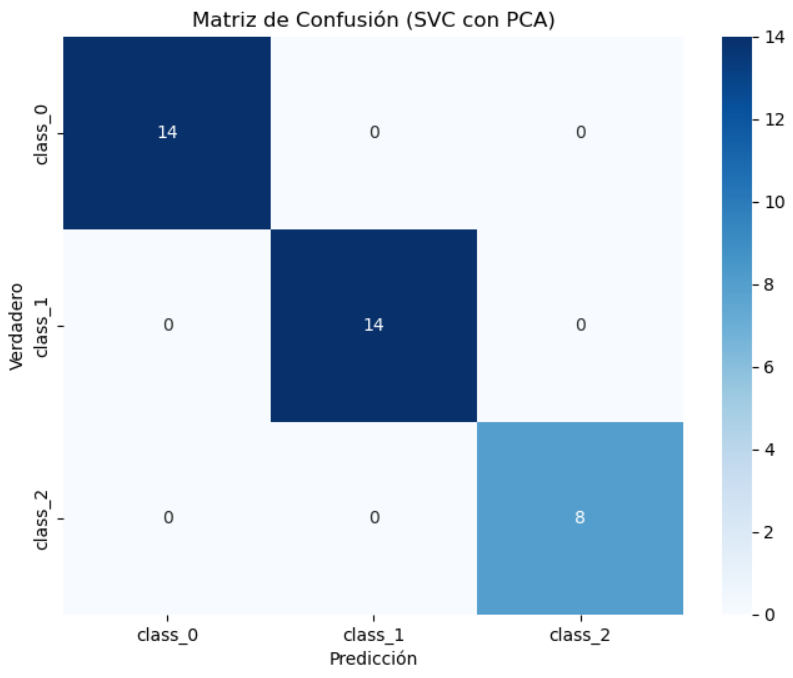

<!DOCTYPE html>
<html lang="es">
<head>
  <meta charset="UTF-8">
  <meta name="viewport" content="width=device-width, initial-scale=1">
  <title>Mario López Guasp - Portfolio</title>
  
</head>
<body>

<!-- CONTENEDOR PRINCIPAL -->

  <!-- ... TODO TU CONTENIDO DE ANTES SE MANTIENE IGUAL ... -->

  <!-- Ejemplo modificado con zoom y ampliación -->
  

    

      <h4 style="margin-bottom: 5px;">Web dinámica sobre datos medioambientales georreferenciados</h4>
      
Análisis y visualización de datos relativos a la contaminación atmosférica y zonas verdes con tal de comprender los motivos que han llevado a Valencia a ser elegida Capital Verde Europea 2024.

      <a href="https://github.com/mariolopezguasp/ValenciaVerde" target="_blank" style="text-decoration: none;">
        

          
        

      </a>
    

    <!-- Imagen con zoom y lightbox -->
    
  

  <!-- Lightbox para ver en grande -->
  

    <a href="#" class="lightbox-close">&times;</a>
    
  

  <!-- Puedes repetir este patrón para todas las imágenes del portfolio -->
  <!-- Otro ejemplo -->
  

    

      <h4 style="margin-bottom: 5px;">Análisis de Vino</h4>
      
Procesos de ETL, extracción de características y visualización sobre los datos del vino.

      <a href="https://github.com/mariolopezguasp/Vino" target="_blank" style="text-decoration: none;">
        

          
        

      </a>
    

    
  

  

    <a href="#" class="lightbox-close">&times;</a>
    
  

</body>
</html>
