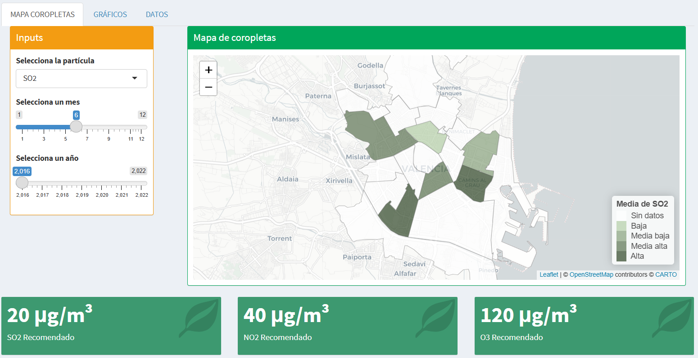
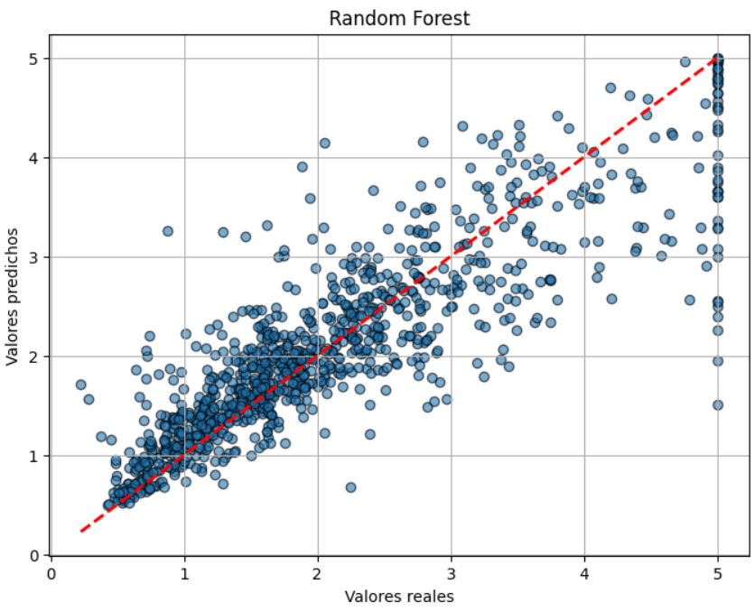
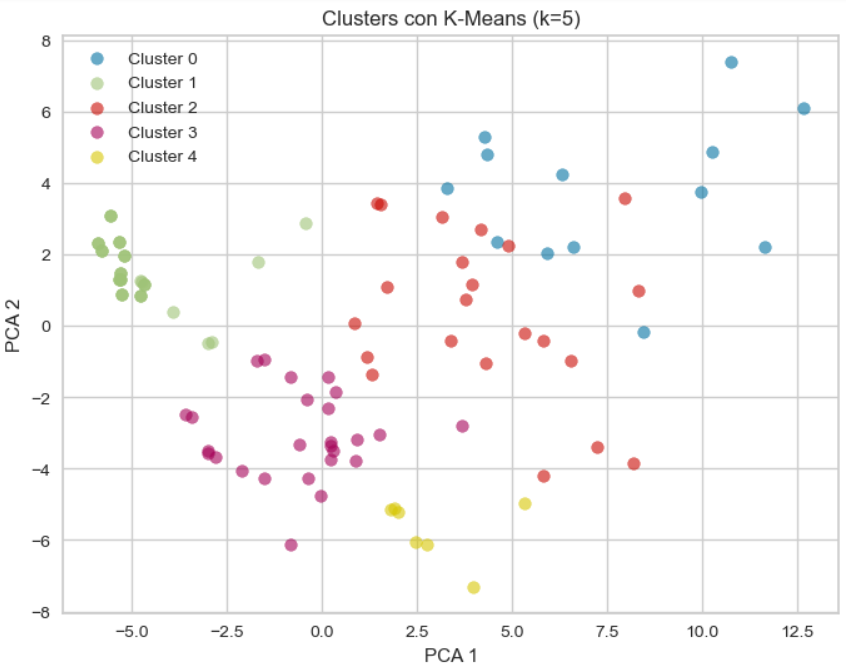

<!-- CONTENEDOR PRINCIPAL -->

  <!-- Header completo con foto a la izquierda y datos a la derecha -->
  

    <!-- Imagen -->
    
    <!-- Información: nombre, título y botones -->
    

      <!-- Nombre y título -->
      

        <h1 style="color: #2c3e50; font-size: 2.2em; margin: 0;">Mario López Guasp</h1>
        <h2 style="color: #3498db; font-weight: 300; margin: 0;">DATA SCIENTIST</h2>
      

      <!-- Botones de contacto -->
      

        <a href="mailto:mariolopezguasp@gmail.com" style="text-decoration: none;">
          

            mariolopezguasp@gmail.com
          

        </a>
        <a href="assets/CV_MarioLopezGuasp.pdf" target="_blank" style="text-decoration: none;">
          

             CV
          

        </a>
        <a href="https://www.linkedin.com/in/mario-l%C3%B3pez-guasp-56b462225/" target="_blank" style="text-decoration: none;">
          

            
            LinkedIn
          

        </a>
        <a href="https://github.com/mariolopezguasp" target="_blank" style="text-decoration: none;">
          

            
            GitHub
          

        </a>
      

    

  

  <!-- Sección Sobre mí -->
  

    <h3 style="color: #2c3e50; border-bottom: 2px solid #3498db; padding-bottom: 5px;">Sobre mi</h3>
    
Soy un científico de datos en proceso de finalizar mis estudios de Ciencia de Datos en la Universidad de Valencia. Estoy muy motivado a desarrollar mis habilidades y conocimientos en el mundo laboral. Tengo una actitud proactiva que hará que mi trabajo se complemente con la visión y objetivos de la empresa.

  

  <!-- Sección Tecnologías -->
  

    <h3 style="color: #2c3e50; border-bottom: 2px solid #3498db; padding-bottom: 5px;">Tecnologías</h3>
    

      Python
      Pandas
      Power BI
      SQL
    

  

<!-- Sección Proyectos -->

  <h3 style="color: #2c3e50; border-bottom: 2px solid #3498db; padding-bottom: 5px;">Proyectos</h3>
  

    

      <h4 style="margin-bottom: 5px;">Web dinámica sobre datos medioambientales georreferenciados</h4>
      
Análisis y visualización de datos relativos a la contaminación atmosférica y zonas verdes con tal de comprender los motivos que han llevado a Valencia a ser elegida Capital Verde Europea 2024.

      <a href="https://github.com/mariolopezguasp/ValenciaVerde" target="_blank" style="text-decoration: none;">
        

          
        

      </a>
    

    
  

<!-- Sección Otros trabajos -->

  <h3 style="color: #2c3e50; border-bottom: 2px solid #3498db; padding-bottom: 5px;">Otros trabajos realizados</h3>

  

    

      <h4 style="margin-bottom: 5px;">Análisis exploratorio completo sobre un dataset de vino</h4>
      
Procesos de ETL, extracción de características y visualización sobre los datos del vino.

      <a href="https://github.com/mariolopezguasp/Vino" target="_blank" style="text-decoration: none;">
        

          
        

      </a>
    

    
  

  

    

      <h4 style="margin-bottom: 5px;">Predicción del precio de vivienda en Florida</h4>
      
Entrenamiento de un modelo de regresión para predecir el precio de la vivienda en Florida.

      <a href="https://github.com/mariolopezguasp/CasasCalifornia" target="_blank" style="text-decoration: none;">
        

          
        

      </a>
    

    
  

  

    

      <h4 style="margin-bottom: 5px;">Agrupamiento de sonidos</h4>
      
Análisis no supervisado para agrupar distintos sonidos según sus características acústicas.

      <a href="https://github.com/mariolopezguasp/AgrupamientoSonidos" target="_blank" style="text-decoration: none;">
        

          
        

      </a>
    

    
  

  <!-- Sección Proyectos -->
  

    <h3 style="color: #2c3e50; border-bottom: 2px solid #3498db; padding-bottom: 5px;">Proyectos</h3>
    

      <h4 style="margin-bottom: 5px;">Web dinámica sobre datos medioambientales georreferenciados</h4>
      
Análisis y visualización de datos relativos a la contaminación atmosférica y zonas verdes con tal de comprender los motivos que han llevado a Valencia a ser elegida Capital Verde Europea 2024.

      <a href="https://github.com/mariolopezguasp/ValenciaVerde" target="_blank" style="text-decoration: none;">
        

          
        

      </a>
    

  

  <!-- Sección Formación -->
  

    <h3 style="color: #2c3e50; border-bottom: 2px solid #3498db; padding-bottom: 5px;">Formación</h3>
    

      <h4 style="margin-bottom: 5px;">Ciencia de Datos | 2022 - 2026</h4>
      
Universidad de Valencia

    

  

  <!-- Sección Otros trabajos -->
  

    <h3 style="color: #2c3e50; border-bottom: 2px solid #3498db; padding-bottom: 5px;">Otros trabajos realizados</h3>
    

      <h4 style="margin-bottom: 5px;">Análisis exploratorio completo sobre un dataset de vino</h4>
      
Procesos de ETL, extracción de características y visualización sobre los datos del vino.

      <a href="https://github.com/mariolopezguasp/Vino" target="_blank" style="text-decoration: none;">
        

          
        

      </a>
    

    

      <h4 style="margin-bottom: 5px;">Predicción del precio de vivienda en Florida</h4>
      
Entrenamiento de un modelo de regresión para predecir el precio de la vivienda en Florida.

      <a href="https://github.com/mariolopezguasp/CasasCalifornia" target="_blank" style="text-decoration: none;">
        

          
        

      </a>
    

    

      <h4 style="margin-bottom: 5px;">Agrupamiento de sonidos</h4>
      
Análisis no supervisado para agrupar distintos sonidos según sus características acústicas.

      <a href="https://github.com/mariolopezguasp/AgrupamientoSonidos" target="_blank" style="text-decoration: none;">
        

          
        

      </a>
    

  

  <!-- Footer con botones de contacto -->
  

    

      <a href="mailto:mariolopezguasp@gmail.com" style="text-decoration: none;">
        

          mariolopezguasp@gmail.com
        

      </a>
      <a href="assets/CV_MarioLopezGuasp.pdf" target="_blank" style="text-decoration: none;">
        

           CV
        

      </a>
      <a href="https://www.linkedin.com/in/mario-l%C3%B3pez-guasp-56b462225/" target="_blank" style="text-decoration: none;">
        

          
          LinkedIn
        

      </a>
      <a href="https://github.com/mariolopezguasp" target="_blank" style="text-decoration: none;">
        

          
          GitHub
        

      </a>
    

  

